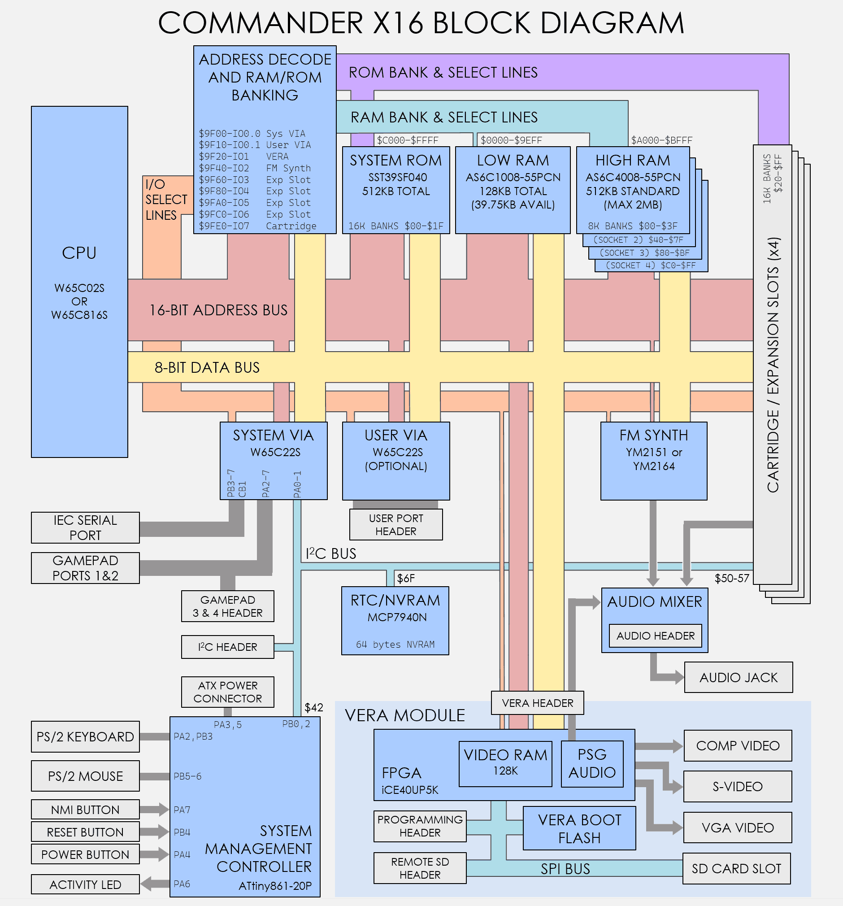

# Chapter 1: Overview

The Commander X16 is a modern 8-bit home computer in the philosophy of Commodore computers like the VIC-20 and the C64. It is designed to be simple and approachable—a system you can fully understand, program, and even modify.

Unlike emulators or FPGA recreations of vintage hardware, the X16 is a *new* design with no original Commodore chips. It uses modern, available components while preserving the programming experience and spirit of classic 8-bit computing.

## About This Guide

This *Programmer's Reference Guide* is intended to be a comprehensive technical manual for software developers.  For a gentler introduction to using the Commander X16, see the [Commander X16 User Guide](https://github.com/X16Community/x16-user-guide).

## Features

* **CPU:** 8 MHz 65C02S or 65C816
* **RAM:** 512 KB banked RAM (upgradeable to 2 MB on the X16 Developer Edition)
* **ROM:** 512 KB containing KERNAL, BASIC, DOS, character sets, and more
* **Expansion:** Expansion Cards & Cartridges
  * Four Expansion Slots
  * Supports up to 3.5 MB of additional RAM/ROM
* **Video (VERA):**
  * Powered by a Lattice ICE40UP5K FPGA  
  * 128k of dedicated Video RAM
  * Up to 640x480 resolution
  * 256 colors from a palette of 4096
  * 128 sprites of up to 64x64 pixels
  * Two layers (tile or bitmap)
  * VGA, NTSC composite, S-Video, and RGB output

* **Audio:**
  * Yamaha YM2151 or YM2164 (FM synthesis): 8 channels, 4-operator, stereo, 162 instruments
  * VERA PSG (waveform synthesis): 16 channels, 4 waveforms (pulse, sawtooth, triangle, noise), stereo
  * VERA PCM (sample playback): Up to 48 kHz, 16-bit, stereo
  * Audio upgrades available via onboard header or Expansion Cards.
* **Connectivity:**
  * PS/2 keyboard and mouse
  * Up to 4 NES/SNES controller ports
  * SD card (FAT32)
  * Commodore Serial Bus ("IEC") for disk drives and printers
  * User port with 16 GPIOs for custom hardware projects

## System Architecture

The following block diagram shows how the major components of the Commander X16 are connected:

The CPU communicates with RAM, ROM, and I/O devices through a shared address and data bus. The VERA handles all video output and also provides the PSG audio channels. The FM synthesizer operates independently for rich sound capabilities. The System VIA (Versatile Interface Adapter) chip handles input from controllers, the PS/2 ports, the IEC serial bus. A second (optional) VIA provides flexible user port GPIOs.

## Commodore Compatibility

The Commander X16 runs officially licensed Commodore BASIC V2 and a compatible KERNAL. This is not a clone or recreation—it is legitimate, licensed software that provides authentic compatibility with classic Commodore programs.

The system was deliberately designed to maximize compatibility with existing Commodore software:

* BASIC program memory starts at $0801, the same as the C64
* The KERNAL jump table at $FF81–$FFF3 provides the same entry points as the C64
* Zero page and low memory usage follows Commodore conventions where possible
* Standard PETSCII character sets (uppercase/graphics and lowercase/uppercase)
* Commodore-style keyboard mapping with PETSCII control codes

| Compatibility Level | Description |
|---------------------|-------------|
| **BASIC programs** | Fully backwards compatible with the VIC-20 and C64 (pure BASIC, no PEEKs/POKEs to hardware) |
| **KERNAL API** | Machine language programs using the standard KERNAL entry points ($FF81+) are compatible |
| **Hardware registers** | *Not compatible*—the X16 has no VIC, SID, or CIA chips. Programs that directly access C64 hardware will not work. |

Pure BASIC programs and well-behaved machine language programs (those using only KERNAL calls) can often run on the X16 with little or no modification. The BASIC interpreter has been extended with many new commands for graphics, sound, and file handling, while retaining full compatibility with classic programs.

<!-- For PDF formatting -->

